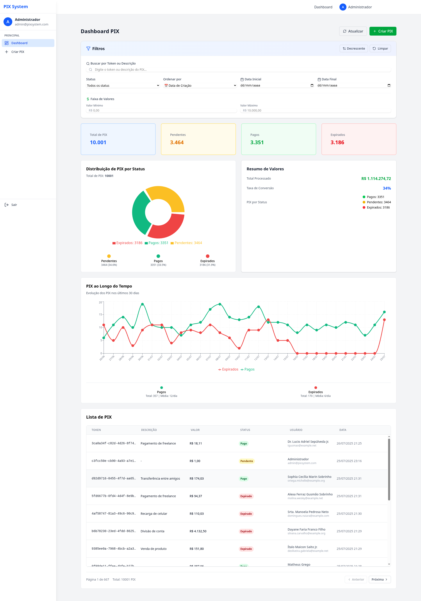
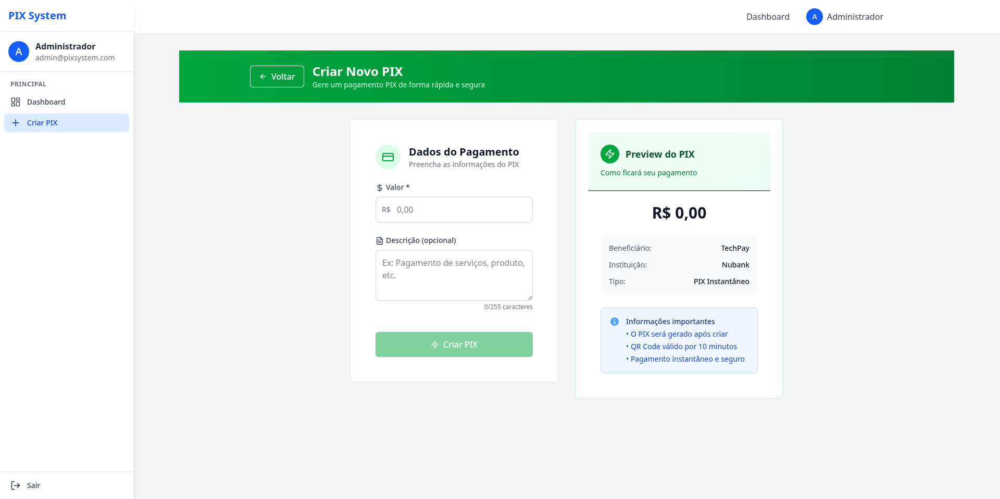
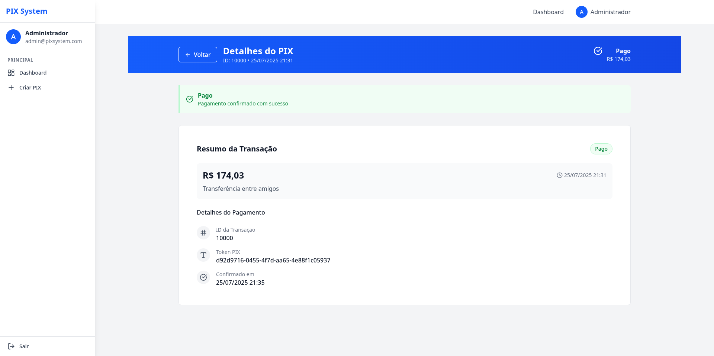
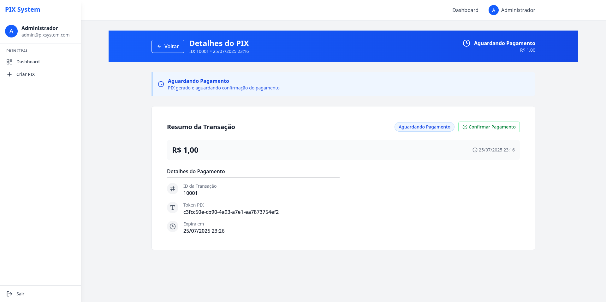
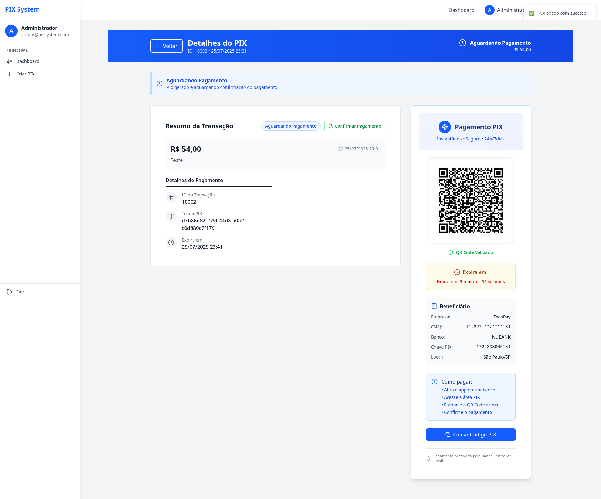

# Sistema de Pagamento PIX Simulado

<div align="center">
  
  
  
  
  
</div>

<br>

Este é um **sistema web completo** para simulação de pagamentos PIX, desenvolvido seguindo **Test-Driven Development (TDD)** e arquitetura **MVC moderna** com separação total entre backend e frontend. A aplicação demonstra domínio de padrões de código, arquitetura robusta, testes automatizados e boas práticas de versionamento Git.

## 🎯 Objetivo do Projeto

Desenvolver uma aplicação web completa que atenda aos requisitos do **TESTE-ENTREVISTA.md**, demonstrando:

- ✅ **Arquitetura MVC** com separação de responsabilidades
- ✅ **Test-Driven Development (TDD)** com coverage mínimo de 80%
- ✅ **Versionamento colaborativo** no GitHub com branches e pull requests
- ✅ **Padrões de código** e boas práticas de desenvolvimento
- ✅ **Sistema PIX funcional** com geração, confirmação e dashboard

## 🏗️ Arquitetura e Stack Tecnológica

### Backend (API RESTful)
- **Laravel 12** - Framework PHP com arquitetura MVC
- **Laravel Sanctum** - Autenticação de API com tokens
- **MySQL 8.0** - Banco de dados relacional
- **PHPUnit** - Testes automatizados com TDD
- **Docker Compose** - Containerização do ambiente

### Frontend (Single Page Application)  
- **React 19** - Biblioteca para interface de usuário
- **TypeScript 5.8** - Tipagem estática para JavaScript
- **Vite** - Build tool moderna e rápida
- **Tailwind CSS** - Framework CSS utilitário
- **Vitest** - Framework de testes para frontend
- **Atomic Design** - Arquitetura de componentes

### DevOps e Qualidade
- **Docker + Docker Compose** - Ambiente de desenvolvimento
- **Makefile** - Automação de comandos (40+ comandos)
- **ESLint + Prettier** - Linting e formatação de código
- **Coverage Reports** - Relatórios de cobertura de testes

---

## 🚀 Como Rodar a Aplicação

### 📋 Pré-requisitos

- [Docker](https://www.docker.com/get-started) & [Docker Compose](https://docs.docker.com/compose/install/)
- [Node.js >= 20.x](https://nodejs.org/en/) (versão LTS recomendada)
- [Git](https://git-scm.com/) para versionamento

---

## 🐳 Opção A: Setup com Docker (Recomendado)

Esta é a forma **mais rápida e fácil** de rodar o projeto. O backend roda em Docker e o frontend localmente.

### 1. Clonar o Repositório
```bash
git clone https://github.com/iurynathan/laravel-pix-system.git
cd laravel-pix-system
```

### 2. Setup do Backend (Automatizado)
```bash
# Configurar variáveis de ambiente
cd backend && cp .env.example .env && cd ..

# Usar o Makefile para setup completo do backend
make up              # Subir containers Docker
make install         # Instalar dependências
make migrate         # Executar migrations e seeds
```

### 3. Setup do Frontend
```bash
# Instalar dependências do frontend
make frontend-install

# Iniciar servidor de desenvolvimento (Nova aba do terminal)
make frontend-dev
```

### 4. Pronto! 🎉
A aplicação estará rodando em:

- **🌐 Frontend**: [http://localhost:5173](http://localhost:5173)
- **🔧 Backend API**: [http://localhost:8000](http://localhost:8000)  
- **📧 MailHog**: [http://localhost:8025](http://localhost:8025)
- **🗄️ phpMyAdmin**: [http://localhost:8080](http://localhost:8080)

---

## 💻 Opção B: Setup Manual (Sem Docker)

Se preferir rodar tudo localmente sem Docker:

### 1. Requisitos Adicionais
- **PHP 8.2+** com extensões: mbstring, xml, ctype, json, bcmath, pdo_mysql
- **Composer** (gerenciador de dependências PHP)
- **MySQL 8.0+** ou equivalente
- **Node.js 20+** com NPM

### 2. Setup do Backend
```bash
# Clonar e acessar o projeto
git clone https://github.com/iurynathan/laravel-pix-system.git
cd laravel-pix-system/backend

# Instalar dependências PHP
composer install

# Configurar variáveis de ambiente
cp .env.example .env

# Configurar conexão com banco de dados no arquivo .env:
# DB_CONNECTION=mysql
# DB_HOST=127.0.0.1
# DB_PORT=3306
# DB_DATABASE=laravel_pix
# DB_USERNAME=seu_usuario
# DB_PASSWORD=sua_senha

# Gerar chave da aplicação
php artisan key:generate

# Executar migrations e seeders
php artisan migrate --seed

# Iniciar servidor de desenvolvimento
php artisan serve
```

### 3. Setup do Frontend
```bash
# Em novo terminal, acessar pasta do frontend
cd frontend

# Instalar dependências
npm install

# Iniciar servidor de desenvolvimento
npm run dev
```

### 4. Criar Banco de Dados
```sql
-- No MySQL, criar banco de dados
CREATE DATABASE laravel_pix CHARACTER SET utf8mb4 COLLATE utf8mb4_unicode_ci;
```

---

## 📱 Como Usar a Aplicação

A aplicação possui um fluxo completo de uso, desde o registro até a confirmação de pagamentos PIX. Aqui está o passo a passo ilustrado com screenshots:

### 1. 📊 Dashboard Principal



O dashboard oferece uma **visão completa** dos seus PIX com:

- **📈 Estatísticas em Cards**: Total de PIX (10.001), Pendentes (3.464), Pagos (3.351), Expirados (3.186)
- **📊 Gráfico de Pizza**: Distribuição visual por status com percentuais
- **📉 Gráfico de Timeline**: Evolução dos PIX pagos vs expirados ao longo do tempo
- **🔍 Filtros Avançados**: Por status, data, valor, descrição
- **📋 Lista Paginada**: Todos os PIX com detalhes (token, valor, status, usuário, data)

### 2. ➕ Criação de PIX



Interface intuitiva para criar novos PIX:

- **💰 Campo de Valor**: Validação em tempo real com formatação brasileira
- **📝 Descrição Opcional**: Até 255 caracteres para identificar o pagamento
- **👀 Preview em Tempo Real**: Visualização de como ficará o PIX antes de criar
- **ℹ️ Informações Importantes**: QR Code válido por 10 minutos, pagamento instantâneo

### 3. ✅ PIX Confirmado (Pago)



Tela de confirmação para PIX que foi pago:

- **✅ Status Verde**: "Pago" com confirmação de sucesso
- **💵 Valor da Transação**: R$ 174,03 claramente destacado
- **🔐 Token PIX**: Identificador único para rastreamento
- **⏰ Data de Confirmação**: Timestamp exato da confirmação

### 4. ⏳ PIX Aguardando Pagamento



PIX gerado e aguardando confirmação:

- **🔵 Status Azul**: "Aguardando Pagamento"
- **🎯 Botão de Confirmação**: Para simular pagamento manual
- **📅 Data de Expiração**: Quando o PIX expirará automaticamente
- **🔗 Token Único**: Para rastreamento e identificação

### 5. 📱 PIX com QR Code



Experiência completa de pagamento PIX:

- **📱 QR Code Funcional**: Gerado dinamicamente, pronto para leitura
- **⏰ Countdown Timer**: "Expira em: 9 minutes 54 seconds" em tempo real
- **🏪 Dados do Beneficiário**: TechPay (NUBANK) com CNPJ mascarado
- **🎯 Instruções Claras**: "Como pagar" com passo a passo
- **📋 Botão "Copiar Código PIX"**: Para pagamento via código
- **🔒 Segurança**: "Pagamento protegido pelo Banco Central do Brasil"

### 🔄 Fluxo Completo de Uso

1. **Cadastro/Login** → Criar conta ou autenticar
2. **Dashboard** → Visualizar estatísticas e PIX existentes  
3. **Criar PIX** → Definir valor e descrição
4. **Compartilhar QR Code** → Enviar para pagador
5. **Confirmação** → PIX é confirmado automaticamente via token
6. **Acompanhamento** → Ver detalhes e status atualizado no dashboard

---

## 📋 Funcionalidades Implementadas

### ✅ Requisitos Atendidos

1. **👥 Usuários**
   - ✅ Registro com nome, email e senha
   - ✅ Login/logout com autenticação segura

2. **💰 PIX Fake**
   - ✅ Geração com `user_id`, `token` (UUID), `status=generated`
   - ✅ Data de expiração configurável (padrão: 10 minutos)
   - ✅ QR Code gerado automaticamente

3. **✅ Confirmação de Pagamento**
   - ✅ Acesso via `/pix/{token}` verifica expiração
   - ✅ Status atualizado para `paid` ou `expired` automaticamente
   - ✅ Página de confirmação com feedback visual

4. **📊 Dashboard MVC**
   - ✅ Tela protegida para usuários autenticados
   - ✅ Cards com contagem por status (gerados, pagos, expirados)
   - ✅ Gráficos interativos de pizza e linha temporal
   - ✅ Lista paginada com filtros avançados

5. **🧪 Testes Automatizados (TDD)**
   - ✅ Coverage de 80%+ nas funcionalidades principais
   - ✅ Testes de Feature: registro, login, geração PIX, confirmação
   - ✅ Testes Unit: models, services, policies
   - ✅ Testes Frontend: componentes, hooks, páginas

6. **🔗 GitHub**
   - ✅ Repositório com branches organizadas
   - ✅ Pull requests com descrições detalhadas
   - ✅ Histórico de commits estruturado
   - ✅ Documentação completa

### 🚀 Funcionalidades Extras Implementadas

- **🔍 Filtros Avançados**: Por status, data, valor, descrição
- **📊 Gráficos Interativos**: Recharts com dados em tempo real
- **🎨 Design Responsivo**: Interface moderna com Tailwind CSS
- **⚡ Performance**: Lista virtualizada para grandes volumes de dados
- **🔒 Rate Limiting**: Proteção contra abuse nos endpoints
- **🧹 Limpeza Automática**: Command para remover PIX expirados
- **📱 QR Code Dinâmico**: Geração em tempo real com informações completas
- **⏱️ Countdown Timer**: Exibição do tempo restante para expiração
- **🎯 UX/UI Moderna**: Feedback visual, loading states, toasts

---

## 🧪 Testes e Qualidade de Código

O projeto segue **Test-Driven Development (TDD)** com cobertura de testes superior a 80% em todas as funcionalidades principais.

### 🔬 Backend (Laravel + PHPUnit)

```bash
# Executar todos os testes
make test

# Testes por categoria
make test-feature    # Testes de integração
make test-unit       # Testes unitários

# Coverage HTML (abre no navegador)
make coverage-backend
```

**Testes Implementados:**
- ✅ **Feature Tests**: `AuthenticationApiTest`, `PixApiTest`, `PixGenerationTest`, `PixConfirmationTest`
- ✅ **Unit Tests**: `PixPaymentModelTest`, `PixServiceTest`, `QrCodeServiceTest`, `PixPaymentPolicyTest`
- ✅ **Performance Tests**: `PixPerformanceTest` para cargas de até 1.000 registros

### 🎯 Frontend (React + Vitest)

```bash
# Executar testes do frontend
make frontend-test

# Coverage HTML (abre no navegador)  
make coverage-frontend

# Testes em modo watch
cd frontend && npm run test
```

**Testes Implementados:**
- ✅ **Componentes**: Todos os atoms, molecules, organisms e templates
- ✅ **Hooks**: `useAuth`, `usePix`, `useDashboard`, `usePixGeneration`
- ✅ **Páginas**: `DashboardPage`, `PixGenerationPage`, `PixConfirmationPage`
- ✅ **Services**: `authService`, `pixService`, `apiService`

### 📊 Relatórios de Coverage

Os relatórios de coverage ficam disponíveis em:
- **Backend**: `backend/coverage-html/index.html`
- **Frontend**: `frontend/coverage/index.html`

### 🔍 Linting e Formatação

```bash
# Backend (PHP)
make shell
php vendor/bin/pint    # Laravel Pint (PHP CS Fixer)

# Frontend (TypeScript)
make frontend-lint     # ESLint
make frontend-format   # Prettier
```

---

## 🛠️ Comandos de Desenvolvimento

O projeto possui um **Makefile** com mais de 40 comandos para facilitar o desenvolvimento:

### 🐳 Comandos Docker (Backend)

```bash
make up              # Subir containers
make down            # Parar containers  
make restart         # Reiniciar containers
make logs            # Ver logs de todos containers
make shell           # Acessar container da aplicação
make db              # Acessar MySQL via CLI
```

### 🗄️ Comandos de Banco de Dados

```bash
make migrate         # Executar migrations
make fresh           # Fresh migration + seeders
make seed            # Executar apenas seeders
```

### 🧪 Comandos de Teste

```bash
make test                    # Todos os testes
make test-coverage          # Testes com coverage simples
make test-coverage-html     # Coverage HTML detalhado
make coverage-open          # Abrir coverage no navegador
```

### 🎨 Comandos Frontend

```bash
make frontend-install       # npm ci
make frontend-dev          # npm run dev  
make frontend-build        # npm run build
make frontend-test         # npm run test
make frontend-lint         # npm run lint
make frontend-format       # npm run format
```

### 🧹 Comandos de Limpeza

```bash
make clear           # Limpar cache Laravel
make clean           # Limpar containers e volumes
make permissions     # Corrigir permissões
```

### 📊 Comandos Específicos do PIX

```bash
# Limpeza automática de PIX expirados
docker-compose exec app php artisan pix:cleanup-expired

# Gerar dados de teste para dashboard
docker-compose exec app php artisan pix:generate-test-data 1000 30 --fresh
```

---

## 📡 Documentação da API

A API RESTful está disponível em `http://localhost:8000/api` e segue padrões REST com autenticação via **Laravel Sanctum**.

#### `POST /api/auth/register`
Registra um novo usuário.

**Payload:**
```json
{
  "name": "João Silva",
  "email": "joao@exemplo.com", 
  "password": "password123",
  "password_confirmation": "password123"
}
```

**Resposta (201):**
```json
{
  "success": true,
  "message": "Usuário registrado com sucesso", 
  "data": {
    "access_token": "1|...",
    "token_type": "Bearer",
    "user": {
      "id": 1,
      "name": "João Silva", 
      "email": "joao@exemplo.com"
    }
  }
}
```

#### `POST /api/auth/login`
Autentica usuário e retorna token de acesso.

**Payload:**
```json
{
  "email": "joao@exemplo.com",
  "password": "password123"
}
```

#### `POST /api/auth/logout` 🔒
Invalida o token de acesso.

#### `GET /api/auth/me` 🔒  
Retorna dados do usuário autenticado.

### 💰 Endpoints PIX

#### `POST /api/pix` 🔒
Cria nova cobrança PIX.

**Payload:**
```json
{
  "amount": 150.50,
  "description": "Venda de produto X"
}
```

#### `GET /api/pix` 🔒
Lista PIX do usuário com filtros e paginação.

**Parâmetros de Query:**
- `status`: `generated`, `paid`, `expired`
- `search`: busca na descrição
- `start_date`, `end_date`: `YYYY-MM-DD`
- `min_value`, `max_value`: valores numéricos
- `sort_by`: `created_at`, `amount`, `status`
- `sort_direction`: `asc`, `desc`
- `per_page`: itens por página (padrão: 15)

#### `GET /api/pix/{id}` 🔒
Detalhes de uma cobrança PIX específica.

#### `DELETE /api/pix/{id}` 🔒  
Remove uma cobrança PIX.

#### `GET /api/pix/statistics` 🔒
Estatísticas para o dashboard (`total`, `paid`, `expired`).

#### `GET /api/pix/timeline` 🔒
Dados para gráfico de linha temporal.

### 🌐 Endpoints Públicos

#### `POST /api/pix/{token}`  
Confirma pagamento de um PIX (rota pública).

#### `GET /api/pix/qrcode/{token}`
Retorna imagem PNG do QR Code.

### 📄 Estrutura do Objeto PixPayment

```json
{
  "id": 1,
  "token": "d92d9716-0455-4f7d-aa65-4e88f1c05937",
  "amount": 150.50,
  "description": "Venda de produto X", 
  "status": "generated",
  "expires_at": "2025-07-25T22:10:00.000000Z",
  "paid_at": null,
  "created_at": "2025-07-25T22:00:00.000000Z", 
  "updated_at": "2025-07-25T22:00:00.000000Z",
  "qr_code_url": "http://localhost:8000/api/pix/qrcode/d92d9716-0455-4f7d-aa65-4e88f1c05937",
  "remaining_time": 599,
  "is_expired": false,
  "is_paid": false, 
  "can_be_paid": true,
  "company": {
    "name": "TechPay",
    "city": "São Paulo/SP"
  }
}
```

---

## 🎯 Arquitetura e Padrões Implementados

### 🏗️ Backend (Laravel MVC)

```
backend/
├── app/
│   ├── Console/Commands/           # Comandos Artisan
│   │   ├── CleanupExpiredPix.php   # Limpeza automática de PIX
│   │   └── GeneratePixTestData.php # Gerador de dados de teste
│   ├── Http/
│   │   ├── Controllers/Api/        # Controllers da API
│   │   ├── Middleware/             # Middlewares customizados
│   │   ├── Requests/              # Form Requests com validação
│   │   └── Resources/             # API Resources para serialização
│   ├── Models/                    # Eloquent Models
│   │   ├── User.php              # Modelo de usuário
│   │   └── PixPayment.php        # Modelo principal do PIX
│   ├── Policies/                 # Políticas de autorização
│   └── Services/                 # Camada de serviços
│       ├── PixService.php        # Lógica de negócio do PIX
│       └── QrCodeService.php     # Geração de QR Codes
├── config/
│   └── pix.php                   # Configurações específicas do PIX
├── database/
│   ├── factories/                # Factories para testes
│   ├── migrations/               # Migrations do banco
│   └── seeders/                  # Seeders para dados iniciais
└── tests/
    ├── Feature/                  # Testes de integração
    └── Unit/                     # Testes unitários
```

### 🎨 Frontend (React Atomic Design)

```
frontend/src/
├── components/
│   ├── atoms/                    # Componentes básicos
│   │   ├── Button/              # Botões reutilizáveis
│   │   ├── Input/               # Inputs com validação
│   │   └── Text/                # Componentes de texto
│   ├── molecules/               # Composições de atoms
│   │   ├── Card/                # Cards informativos
│   │   ├── FormField/           # Campo de formulário completo
│   │   └── Modal/               # Componente de modal
│   ├── organisms/               # Seções complexas
│   │   ├── Header/              # Cabeçalho da aplicação
│   │   └── Sidebar/             # Menu lateral
│   └── templates/               # Layouts de página
│       ├── AppLayout/           # Layout principal
│       └── AuthLayout/          # Layout de autenticação
├── features/                    # Funcionalidades organizadas
│   ├── auth/                    # Autenticação
│   ├── dashboard/               # Dashboard e estatísticas
│   └── pix/                     # Funcionalidades do PIX
├── hooks/                       # Custom hooks reutilizáveis
├── services/                    # Serviços de API
├── context/                     # Context API para estado global
└── utils/                       # Utilitários e helpers
```

### 🔐 Segurança Implementada

- **🛡️ Laravel Sanctum**: Autenticação baseada em tokens
- **🚫 Rate Limiting**: Proteção contra abuse de API (10 req/min por usuário)
- **✅ Validation**: Form Requests com validação server-side
- **🔒 CSRF Protection**: Proteção contra ataques CSRF
- **🏛️ Policies**: Controle de acesso granular por recurso
- **🔐 Middleware**: Autenticação e autorização em todas rotas protegidas

### ⚡ Performance e Escalabilidade

- **📊 Indexes Otimizados**: Banco de dados com índices para consultas frequentes
- **🎯 Eager Loading**: Evita problema N+1 em consultas
- **💾 Cache**: Redis para sessões e dados frequentes
- **📱 Virtualização**: Lista de PIX virtualizada para grandes volumes
- **📄 Paginação**: API paginada para melhor performance
- **🔄 Debounce**: Filtros com debounce para reduzir requisições

---

## 🚀 Deploy e Produção

### 📦 Build para Produção

```bash
# Frontend
make frontend-build

# Backend (dentro do container)
make cache              # Cache de configuração
docker-compose exec app php artisan config:cache
docker-compose exec app php artisan route:cache
docker-compose exec app php artisan view:cache
```

### 🔧 Variáveis de Ambiente Importantes

**Backend (.env):**
```env
APP_ENV=production
APP_DEBUG=false
DB_CONNECTION=mysql
DB_HOST=mysql
DB_DATABASE=laravel_pix
PIX_EXPIRATION_MINUTES=10
PIX_CLEANUP_ENABLED=true
```

**Frontend:**
```env
VITE_API_URL=http://localhost:8000/api
VITE_APP_NAME="PIX System"
```

---

## 🔍 Troubleshooting

### ❗ Problemas Comuns

**1. Erro de permissão no Docker**
```bash
make permissions        # Corrigir permissões
sudo chown -R $USER:$USER .
```

**2. Frontend não conecta com backend** 
- Verificar se a API está rodando: `curl http://localhost:8000/api`
- Verificar variável `VITE_API_URL` no frontend

**3. Testes falhando**
```bash
# Limpar cache antes dos testes
make clear
make test
```

**4. MySQL não sobe**
```bash
# Limpar volumes e recriar
make clean
make up
```

### 📋 Verificação de Saúde do Sistema

```bash
# Status dos containers
make ps

# Logs em tempo real  
make logs

# Acessar banco de dados
make db

# Status da aplicação
curl http://localhost:8000/api/health
```

---

## 🤝 Contribuindo

### 📝 Padrões de Commit

```bash
feat(scope): adiciona nova funcionalidade
fix(scope): corrige bug específico  
test(scope): adiciona ou modifica testes
refactor(scope): refatoração de código
docs(scope): atualiza documentação
style(scope): mudanças de formatação
```

### ✅ Checklist antes do PR

- [ ] Testes passando (backend e frontend)
- [ ] Coverage de testes mantido (>80%)
- [ ] Linting sem erros

---

## 📄 Licença

Este projeto é desenvolvido para fins educacionais e de demonstração técnica.

---

## 👨‍💻 Autor

Desenvolvido por **Iury Nathan** como demonstração de competências técnicas em:

- ✅ **Arquitetura MVC** moderna e escalável
- ✅ **Test-Driven Development** com alta cobertura
- ✅ **APIs RESTful** seguindo padrões da indústria  
- ✅ **React/TypeScript** com Atomic Design
- ✅ **DevOps** com Docker e automação
- ✅ **Versionamento Git** colaborativo

---

<div align="center">
  <strong>Sistema PIX Simulado - Demonstração Técnica Completa</strong><br>
  Laravel 12 + React 19 + TypeScript + Docker + TDD
</div>
